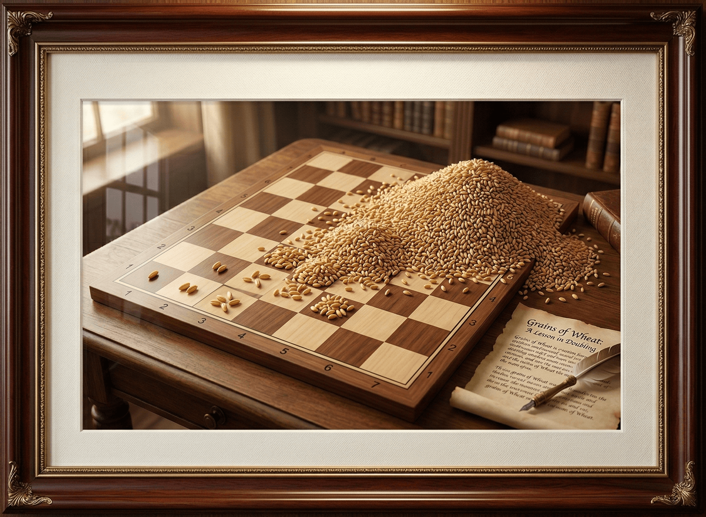

# Grains



## Instructions

Write a program that calculates the number of grains of wheat on a chessboard given that the number on each square doubles.

There once was a wise servant who saved the life of a prince. The king promised to pay whatever the servant could dream up. Knowing that the king loved chess, the servant told the king he would like to have grains of wheat. One grain on the first square of a chess board. Two grains on the next. Four on the third, and so on.

There are 64 squares on a chessboard.

Write a program that shows

- how many grains were on each square, and
- the total number of grains

## Running Tests

To run the test suite, execute the following command from the project root:

```bash
npx jasmine --config=spec/support/jasmine.json
```
